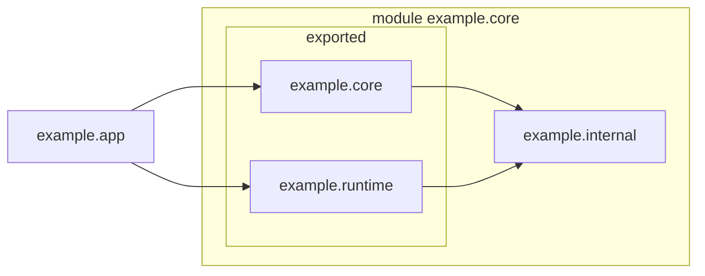
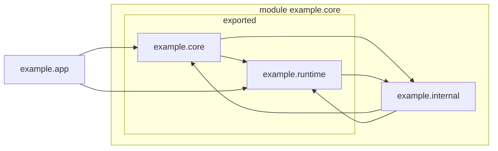

# Structural Toy for Jython 3

## Purpose

### Original Purpose

I originally created this to explore the use of Java modules
to control leakage of the Jython implementation
into the API we would offer to:
* extension modules in Java, and
* Java applications that embed a Python interpreter.

Python user code will be compiled to class files that
run in the JVM.
These classes necessarily belong to some package
outside the module we supply.
We therefore recognise a third type of API client
(and in practice it will be the most common):
* JVM classes compiled from Python.

### Problem to Solve

Jython 2 used Java packages as a structural device,
in the way they have existed for decades.
The approach suffers a problem when
a class X defined in package A for local use
becomes useful in package B.
It can either be re-implemented in B (a maintenance burden),
or made public from A,
or public from third package to which it moves.
If made public,
it potentially becomes a dependency for
any number of client applications,
making X difficult to change or discard in future.

It might be thought that the public classes of a package
could and should only need utility classes from their own package.
It seems not to be true, or if theoretically true,
not possible without perfect knowledge of design in advance.
And anyway it is far too late for Jython 2:
the unintentional API is enormous.

### A Solution Offered

This is a problem that the Java Jigsaw Project has solved
with the introduction of a module concept that
offers control over the visibility of *packages*:
classes that are public from any given package A,
become public API only if A is exported from the module.
If we move previously local service X from A
to be public from package C, and we do not export C,
then X may be used from any package in the module,
but does not become API.

Thus with a single module to contain Jython,
we have two (only two) categories of package:
* interface (public classes are API), and
* internal (public classes are not API).

It is not immediately apparent how we should organise
the set of classes in our implementation,
which depend on each other in complex interactions.
We will take simplified versions of these classes
from the prototype Jython 3
and try to give them the visibility they need of each other,
without making implementation details visible to a client.

### Model

All three client types: applications,
third party extensions,
and byte code class definitions compiled from Python,
must be in packages outside the Jython module.
We can conduct the experiment with just two modules:
* `core` represents the Jython implementation.
  We may have several modules in the end,
  but it does not help us to have more than a few.
* `app` represents an application that embeds Jython,
  brings an extension module
  and executes compiled Python.

We cannot compile Python in the toy,
but we can write Java code that samples the run time support
for frames and operations.

### A Bonus

This toy may also be a good way to explain aspects of
the Jython 3 architecture.
It is greatly simplified relative to the real
structure of the interpreter.
These simplifications will be misleading in some cases.


## Build

This project builds with Gradle.
In the top level of the project, you may easily build and run it
with (in Windows Powershell):

```
PS Structure Toy> .\gradlew  run

> Task :app:run
neg(-42) = 42
add(33, 9) = 42
<module 'my_extension' (built-in)>
<built-in function 'foo'>
  1    18
  2    36
  3    42
  4    42
  5    42
  6    48
  7    66
MyType(3)
MyType(42)

BUILD SUCCESSFUL in 7s
5 actionable tasks: 5 executed
```

It is definitely more interesting to read the source and run it under a debugger.
There are two sub-projects:
* `core` contains a few fragments of Jython implementation.
* `app` contains an application that embeds Jython.
The application you run is `Application.java`,
in the `app` sub-project.

In order to run the project, Gradle makes two jars:
`./core/build/libs/core.jar`,
which you can think of as modelling the Jython distributable, and
`./app/build/libs/app.jar`,
which contains the Application class,
an extension module,
and an inner class that defines a Python type.
This then makes a tiny model of the way a client application
might consume an embedded Jython.

All artifacts of the build are generated into the `build` folders
of their respective projects.
Although Gradle will build both from one command,
they are effectively built independently
and result in separate artifact sets.

There is a `javadoc` task.
It warns a lot about places I haven't documented properly,
but it currently runs without error.

The Gradle task `app:installDist` will create a launch script
for the `app` project, in `.\app\build\install\app\bin`,
and jar files for both `app` and `core` in the `lib` folder
next to it. You can run that script with:

```
PS Structure Toy> .\app\build\install\app\bin\app
neg(-42) = 42
add(33, 9) = 42
<module 'my_extension' (built-in)>
...
```

There are also tasks `distZip` and `distTar`
that will zip up the `app/bin` and `app/lib` directories so
you can install the toy application elsewhere.

These are all standard Gradle tasks.
There is very little customisation in the the build scripts.
All we've done is organise our project the way Gradle finds natural.


## Discoveries

### It's really very simple

The use of modules to control visibility brings one simple constraint.
We have two (only two) categories of package:
interface packages (public classes are API),
and internal packages (public classes that are not API).
We may think of interface packages as "front row" and
internal packages as "back row".



We may organise, and re-organise, the back row (or rows) how we please,
to satisfy an architectural discipline about the flow of imports.
(For example, we may like to package according to feature
and without cycles.)
That certain packages are "front row", however,
is a significant constraint what may be put in those packages.


### Circular Dependencies

In the toy as it stands we have circular dependencies amongst packages.
API classes in the "front row" depend on (public but not exposed)
classes in the back row for their functioning.
Meanwhile front row packages define interfaces or data types
that the back row must reference in implementation.



It may be that, with a few more packages,
we may break these cycles.


### Visibility of Python Types

It seems necessary to expose certain object types
(e.g. `PyType` and `JavaModule`)
and in other cases it was possible to keep an implementing class
on the back row (e.g. `PyInt`).

Should types that are well-known built-ins of Python
not be public API for a client?
Probably they should.
However, if these have any methods safe only for internal use,
the unsafe methods will have leaked into the API.
An approach is necessary that allows the client to handle
familiar types without that leakage.


### Exposed Interface

A way of loosening the coupling between front and back is to define
some types in the API as an interface.
We could, for example, make `PyType` an interface.
Classes in the back row then implement these interfaces
and provide behaviour and additional non-API public methods.

The API of the runtime will necessarily name the interface classes,
not the concrete implementations,
in the signatures of its methods.
A client application may implement those interfaces
on objects that do not have the expected behaviour.
In order to defend the runtime against surprises,
we shall need checked casts raising meaningful exceptions.


### Exposed Abstract Class

Using abstract classes instead of interfaces allows us more control
over the behaviour of objects of the given type.
We can make it impossible for the client to sub-class the object,
by giving it a package private constructor.
Instances can only be provided by
a factory object in the same package.
A cast is still necessary but it can never fail,
short of an internal error.

Or is this a non-problem?
If objects have no implementation backdoors.
We have eliminated the need to re-write a `tuple`
by introducing an efficient builder object.
